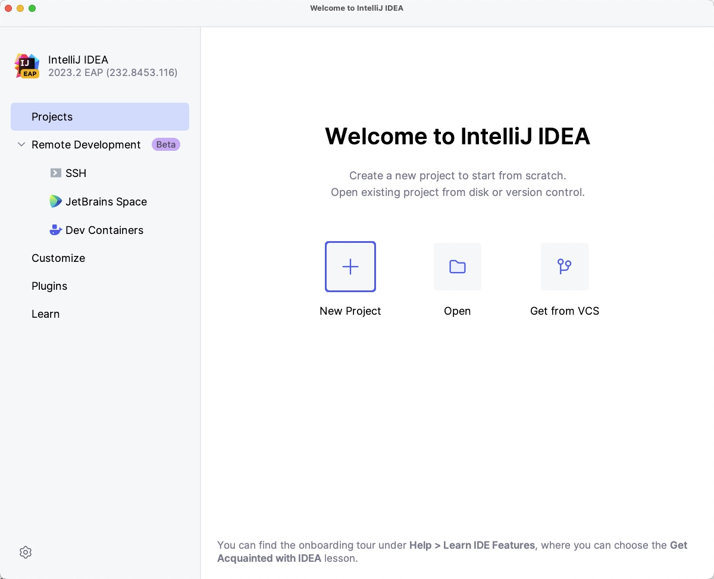
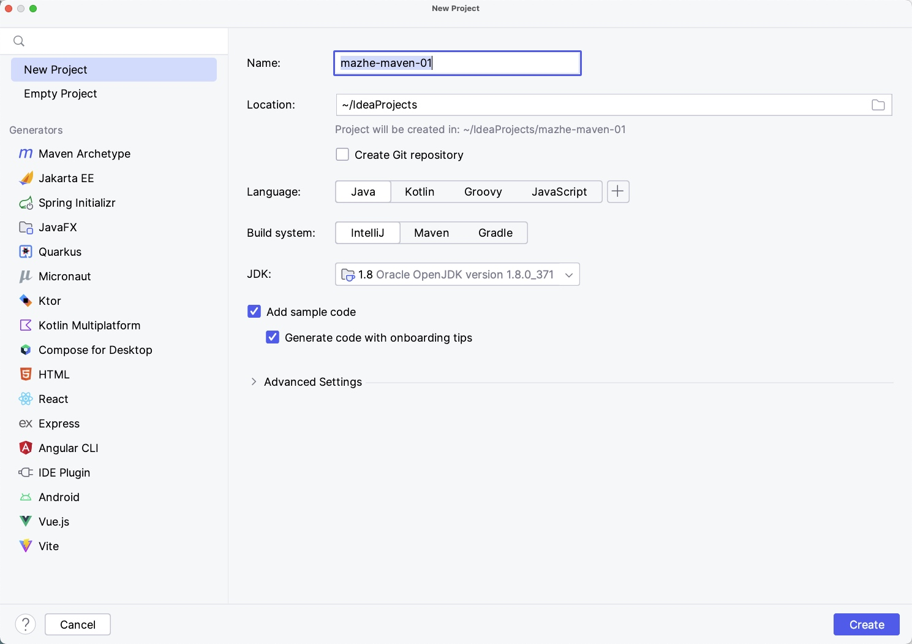
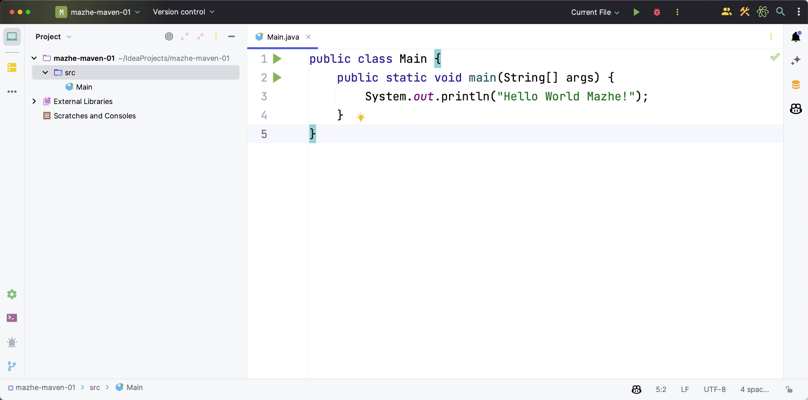
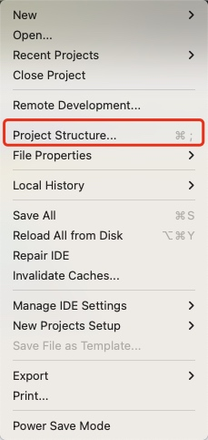
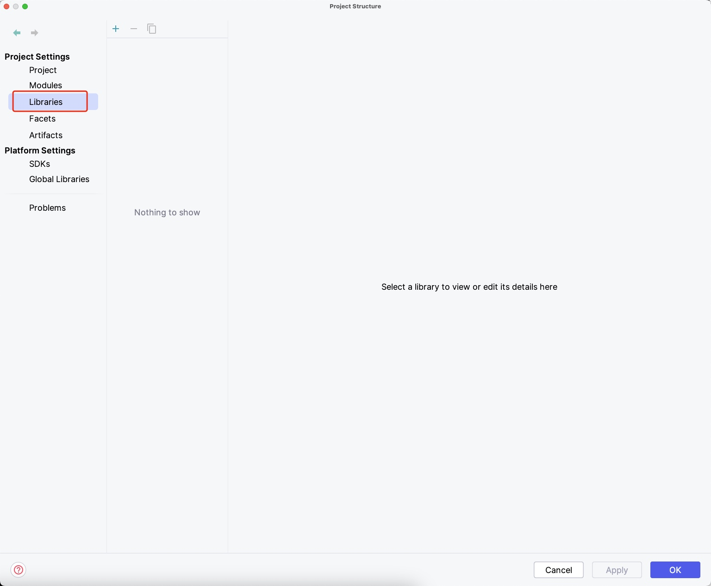
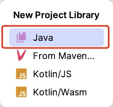
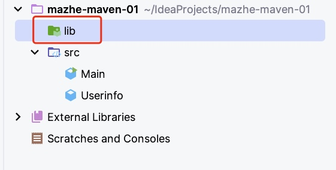
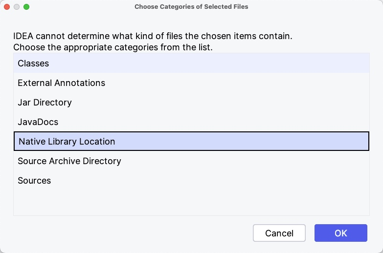
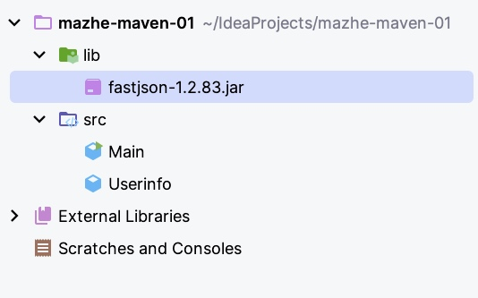

# Maven实战-第一篇（Maven的基本信息）

## 什么叫做Maven

在上一篇中我们简单的介绍了一下 Maven实战这本书的简介以及相关的背景，在这一篇中我们开始详细的介绍一下这本书的内容。今天我们分享的内容主要是详细的介绍一下Maven的基本信息。例如什么叫做Maven，为什么我们需要Maven，以及如何安装它。

首先我们从英语的角度看什么是Maven。在英语的角度上看Maven可以翻译为“内行、专家”。所以当我们以后看到这个单词的时候，它除了是一项技术外，我们还学习了一个新的单词的含义。那么在技术领域的角度上看。Maven实际上是一个跨平台的项目管理工具。说是项目管理工具，是因为它支持项目的的构建、编译、打包和依赖管理等内容。（如果不理解上面说的构建、编译、打包是什么意思，也不用担心，后面的章节中将详细介绍）。说它夸平台是因为Maven是由Java语言开发的。所以在使用Maven的时候，必须安装JDK才可以使用。并且Maven也是Apache组织中的开源的项目。为什么要强调这一点呢，是因为如果一个项目是Apache的项目，大概率这样的开源项目流行的概率是比较大的。总之简单概括一下，Maven是一个跨平台的项目管理工具，它支持项目的构建、编译、打包和依赖管理等内容。

## 为什么需要Maven

介绍了这么多Maven的好处，那么我们在日常的开发中为什么需要Maven呢？在没有Maven之前我们如何开发呢。下面我们带着这个问题，看一下下面的例子，例子很简单，我们使用工具类将对象转成Json字符串并输出。并且先不使用Maven的情况下实现上面的内容呢。实现上面的方式的工具类比较多fastjson的方式实现。

我们首先创建一个普通的Java项目，具体操作如下：






然后我们随便输出一句话看一下项目是否有问题。



> Hello World Mazhe!

下面我们创建一个Userinfo对象，然后输出对象的属性。具体操作如下：

```java
public class Userinfo {
    /**
     * 用户名
     */
    private String username;

    /**
     * 密码
     */
    private String password;

    public Userinfo(String username, String password) {
        this.username = username;
        this.password = password;
    }

    @Override
    public String toString() {
        return "Userinfo{" +
                "username='" + username + '\'' +
                ", password='" + password + '\'' +
                '}';
    }
}

```
输出：
> Userinfo{username='mazhe', password='maven'}

下面我们引入fastjson的依赖包，由于我们不使用Maven，所以我们使用下面的方式引用，具体操作如下：



我们在IDEA的File菜单中选择`Project  Structure ...`

然后选择`Libraires`



点击`+`选择`Java`然后选择我们的之前下载的fastjson依赖包即可。



但这样有一个问题，就是如果这样话，那么如果我的把下载的依赖包的位置主移动了话，那么项目的就找不到依赖包了。当然如果我们项目只吸引入一个依赖的话，这样还是比较方便的。但实际的开发中，我们项目依赖的依赖包非常的多，如果引入的目录也不同的话，那么是非常难管理的。所以为了避免，因为依赖包目录移动，而可能导致的其它问题，我们采用下面的方式引用。

我们首先在项目的目录中创建一个目录，我们项目中引入的所有依赖包，都放到这个目录中，例如叫：`lib`。



然后我们采用上面同样的操作，只不到在上面最后一步时，我们不选择具体的依赖包，而是直接选择我们刚刚创建的目录。然后选择`Native Library Location`选项。



这样我们的配置工作就完成了，我们只需要把之前下载的依赖包拷贝到我们之前创建的依赖包目录中就可以在项目中的依赖这个依赖包了。




但有些时候，这样还是不能在项目中使用这个依赖包。因为项目并没有实现出这个外部的依赖。我们也可以从另外一个角度中看出，我们项目引入的依赖包是否可用。我们从上图也可以看出来。上面显示的还是一个依赖包，并没有显示出依赖的包具体的目录结构，所以这样显示意味着项目并没有识别出来。


---

我们可以用组装PC和品牌PC为例子。形象的介绍一下使用Maven和没有使用的Maven工作效率的区别。

## 和Maven很像的东东

下面我们看一下，在没有Maven之前，都有哪些和Maven类似的项目构建的工具，它们和Maven有哪些区别。这样才能更好的掌握Maven。

* Make

Make几乎可以理解为最早的项目构建工具。它由Stuart Feldman于1977年在Bell实验室创建的。在使用Make时需要定义一个名为Makefile的脚本，Make通过该脚本来达到项目构建的目的。该脚本使用了Make自己定义的语法格式。语法中包括一部分规则（Rules），而规则中又包括目标（Target）、依赖（Prerequisite）和命令（Command）等信息。
下面是具体的Make的语法如下：

```
# 指定编译Java代码时使用的参数
JFLAGS = -g

# 指定Java编译器
JC = javac

# 指定生成Jar包时使用的参数
JARFLAGS = cvfm

# 指定生成的Jar包文件名
JARFILE = MyProgram.jar

# 定义一种依赖关系，指示如何从.java文件生成.class文件
.SUFFIXES: .java .class
.java.class:
        $(JC) $(JFLAGS) $*.java

# 定义要编译的Java源代码文件列表
CLASSES = \
        MyClass1.java \
        MyClass2.java \
        MyClass3.java

# 定义默认规则，指示执行`jar`规则
default: jar

# 定义`classes`规则，指示如何编译Java源代码
classes: $(CLASSES:.java=.class)

# 定义`jar`规则，指示如何生成Jar包
jar: classes
        jar $(JARFLAGS) $(JARFILE) Manifest.txt $(CLASSES:.java=.class)

# 定义`clean`规则，指示如何清理生成的class文件和Jar包文件
clean:
        $(RM) *.class $(JARFILE)

```
上述Makefile文件包含以下规则：

default：默认规则，指定执行jar规则。
classes：编译Java源代码生成class文件。
jar：生成Jar包。
clean：清理生成的class文件和Jar包文件。
要生成Jar包，只需在终端窗口中输入make jar命令即可。该命令会执行Makefile文件中定义的jar规则，生成Jar包。如果需要清理生成的class文件和Jar包文件，可以输入make clean命令。

* Ant

在Make之后，Ant出现了。在Ant中使用了build.xml作为项目的构建脚本。具体的Ant脚本的配置如下：

```xml
<?xml version="1.0"?>
<project name="MyProject" default="jar">
    <!-- 定义项目的属性 -->
    <property name="src.dir" value="src"/>
    <property name="build.dir" value="build"/>
    <property name="dist.dir" value="dist"/>
    <property name="main.class" value="com.example.MyClass1"/>

    <!-- 创建目标目录 -->
    <target name="init">
        <mkdir dir="${build.dir}"/>
        <mkdir dir="${dist.dir}"/>
    </target>

    <!-- 编译Java源代码 -->
    <target name="compile" depends="init">
        <javac srcdir="${src.dir}" destdir="${build.dir}"/>
    </target>

    <!-- 生成Jar包 -->
    <target name="jar" depends="compile">
        <jar destfile="${dist.dir}/${ant.project.name}.jar" basedir="${build.dir}">
            <manifest>
                <attribute name="Main-Class" value="${main.class}"/>
            </manifest>
        </jar>
    </target>

    <!-- 清理生成的文件 -->
    <target name="clean">
        <delete dir="${build.dir}"/>
        <delete dir="${dist.dir}"/>
    </target>
</project>
```
上述Ant build.xml文件包含以下任务：

init：创建编译和生成Jar包所需的目录。
compile：编译Java源代码。
jar：生成Jar包。
clean：清理生成的文件。
要生成Jar包，只需在终端窗口中输入ant jar命令即可。该命令会执行build.xml文件中定义的jar任务，生成Jar包。如果需要清理生成的文件，可以输入ant clean命令。

注意：在执行该build.xml文件之前，需要将文件中的属性值替换为您的项目属性。例如，src.dir属性指向包含Java源代码的目录，main.class属性指向包含main方法的类的类名，这将是您的程序的入口点。


## Maven有哪些缺点

* Maven过于复杂
因为Maven是用来管理项目的，清理、编译、测试、打包、发布，以及一些自定义的过程都是一件非常复杂的事，所以Maven入门比较难。

* Maven的仓库十分混乱
有时会遇到无法从仓库中下载类库时，需要我们手动下载并复制到本地仓库中。除此之外，Maven的中央仓库并不完美，你们常常会发现相同的类库在两个不同的路径中。

* Maven官方文档非常凌乱
Maven的官方网站的文档非常凌乱，各种插件的文档寻找非常吃力。


## Maven的安装
* 安装前环境的准备

由于Maven是使用Java语言开发的，所以在使用Maven之前需要提前把Java的环境安装好，也就是需要检查是否成功的安装了JDK。具体执行的命令如下：
```
java -version
```
如果本地成功的安装JDK，则会直接显示Java的版本信息。如果想查询本地JDK的安装路径可以执行下面的命令查询：

```
echo $JAVA_HOME
```

* 下载Maven

下面我了解一下如何下载Maven。和其它开源软件一下，软件的下面一定是要通过官方网站下载的。下面是Maven官方网站的地址：
> [https://maven.apache.org](https://maven.apache.org/)

当我们访问上述官方网站时，会有多种类型的安装包供我们下载，具体如下：


|  |Link| Checksums | Signature |
|---|---|---|---|
|Binary tar.gz archive| apache-maven-3.9.1-bin.tar.gz |apache-maven-3.9.1-bin.tar.gz.sha512  |apache-maven-3.9.1-bin.tar.gz.asc  |
|Binary zip archive|apache-maven-3.9.1-bin.zip|apache-maven-3.9.1-bin.zip.sha512|apache-maven-3.9.1-bin.zip.asc|
|Source tar.gz archive|apache-maven-3.9.1-src.tar.gz|apache-maven-3.9.1-src.tar.gz.sha512|apache-maven-3.9.1-src.tar.gz.asc|
|Source zip archive|apache-maven-3.9.1-src.zip|apache-maven-3.9.1-src.zip.sha512|apache-maven-3.9.1-src.zip.asc|

它们具体的区别是，提供了不够平台的下载文件。如果是Linux或者是MacOS推荐使用`tar.gz`的下载文件，如果是Windows平台的推荐使用`zip`后缀的下载文件。除此之外，Maven官方还提供了，上述不同平台的md5校验和（checksum）文件和asc数字签名文件，目的是可以用来检验Maven下载包的正确性和安全性。如果你想对Maven的源码感兴趣可以下载`src`的版本文件，自己构建Maven。

* 安装Maven

当我们下载完对应的平台的版本后，我们直接解压然后配置Maven的环境变量。在Windows平台中可以使用下面的方式配置：
* 在系统的环境变量中新创建一个`M2_HOME`的变量，路径为上面Maven解压后的全路径。
* 然后在系统中环境变量中查找到`Path`变量，然后在改变量的后面追加下面的配置：
```
%M2_HOME%\bin;
```
注意后面的分号。如果配置完成后，可以在命令窗口中查询一下配置的`M2_HOME`的变量是否配置成功。
```
echo%M2_HOME%
```
如果该命令输入的结果是我们Maven下载后解压的路径，则表示我们配置成功了。接着我们可以输入下面的命令来验证Maven是否安装成功。
```
`mvn-v`
```
如果此命令成功的显示了Maven的安装版本则表示，我们Maven配置的成功了。
下面我们看一下Linux或者MacOS系统如何配置Maven环境变量。在上述平台中需要输入下面的命令配置：
```
sudo vim ~/.bash_profile
```
配置对应平台的Maven解压后的路径
```
export MAVEN_HOME=/Users/jilinwula/Downloads/apache-maven-3.6.3
export PATH=$PATH:$MAVEN_HOME/bin
```
当然配置完成后，需要执行下面的命令，让上述的配置立即生效。
```
source ~/.bash_profile
```
在完成上述的配置后，我们还是输入`mvn-v`命令，看检查是否成功的返回的Maven的版本信息。

## Maven的目录结构

下面我们介绍一下Maven的安装包的目录结构，在Maven的下载包中主要包括下面的目录和文件：
* bin


此目录中包括了Maven所运行的脚本文件，其中没有带`.cmd`后缀的命令为Linux平台的脚本文件，带`.cmd`后缀的为Windows平台的脚本文件。在此目录中还提供了我们上述中介绍过的`mvn`命令脚本。并且还提供了`mvnDebug`命令。它俩的区别是后者在运行时开启debug模式，可以调试Maven。

* boot

该目录下只有一个jar文件。该文件的作用是Maven自己实现的类加载器。和默认的Java类加载器相比，它提供了丰富的语法和配置，Maven使用此类加载器加载自己的类库。

* conf

该目录中包含了一个非常重要的文件`settings.xml`文件。在后续的内容中我们会详细`settings.xml`文件。通过该文件我们可以全局地定制Maven的行为。

* lib

该目录中包括了Maven运行时依赖的所有的Java类库。


## Maven的最佳实践

* 设置MAVEN_OPTS环境变量
* 配置用户范围的settings.xml